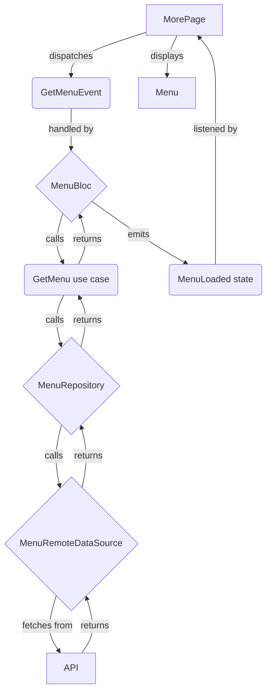

### MODIFICATION_DESIGN.md

#### Overview

The goal is to replace the static menu in the "More" screen with a dynamic menu fetched from the API endpoint `https://admin.monobox.app/api/v1/pages/menu_links`. The implementation should be able to handle cases where a menu item from the API is already implemented statically in the app, in which case the static implementation should be used.

#### Detailed analysis of the goal or problem

The current implementation in `lib/features/more/presentation/pages/more_page.dart` uses a hardcoded list of `profile_item_model.ProfileItem` objects to display the menu. This is inflexible and requires an app update to change the menu items.

The API provides a JSON response with a `mobile` key, which contains an array of menu groups. Each menu group has a title and a list of links. Each link has a title, a link, an icon, and a target.

The task is to:
1.  Create data models for the API response.
2.  Create a data source to fetch the data from the API.
3.  Create a repository to abstract the data source.
4.  Create a use case to get the menu data.
5.  Inject the dependencies using the existing dependency injection setup.
6.  Modify the `MorePage` to use a `Bloc` to manage the state of the menu.
7.  The `Bloc` will fetch the menu data using the use case.
8.  The `MorePage` will display the menu items from the `Bloc`'s state.
9.  For each menu item, if a static implementation exists, it will be used. Otherwise, a generic implementation will be used to navigate to the link provided in the API response.

#### Alternatives considered

1.  **Fetching the menu directly in the `MorePage` widget.** This is not a good practice as it mixes UI and business logic, and makes the code harder to test and maintain.
2.  **Using a different state management solution.** The project already uses `flutter_bloc`, so it's better to stick with it for consistency.

#### Detailed design for the modification

1.  **Data Models:**
    *   Create `MenuResponse`, `MenuGroup`, and `MenuLink` data models with `fromJson` constructors to parse the JSON response. These models will be placed in `lib/features/more/data/models/`.
    *   The models will use `json_serializable` for code generation.

2.  **Data Source:**
    *   Create an abstract class `MenuRemoteDataSource` in `lib/features/more/data/datasources/`.
    *   Create an implementation `MenuRemoteDataSourceImpl` that uses the `http` package to fetch the data from the API. It will have a method `Future<MenuResponse> getMenu()`.

3.  **Repository:**
    *   Create an abstract class `MenuRepository` in `lib/features/more/domain/repositories/`.
    *   Create an implementation `MenuRepositoryImpl` in `lib/features/more/data/repositories/` that uses the `MenuRemoteDataSource` to get the menu data. It will have a method `Future<Either<Failure, MenuResponse>> getMenu()`.

4.  **Use Case:**
    *   Create a use case `GetMenu` in `lib/features/more/domain/usecases/` that calls the `MenuRepository` to get the menu data.

5.  **Dependency Injection:**
    *   Update `injection_container.dart` to register the new data source, repository, use case, and `Bloc`.

6.  **Bloc:**
    *   Create `MenuBloc`, `MenuState`, and `MenuEvent` in `lib/features/more/presentation/bloc/`.
    *   `MenuEvent` will have a `GetMenuEvent`.
    *   `MenuState` will have `MenuInitial`, `MenuLoading`, `MenuLoaded`, and `MenuError` states.
    *   `MenuBloc` will handle the `GetMenuEvent` by calling the `GetMenu` use case and emitting the appropriate states.

7.  **UI:**
    *   Modify `MorePage` to use a `BlocProvider` to provide the `MenuBloc`.
    *   The `MorePage` will dispatch the `GetMenuEvent` in the `initState`.
    *   The `MorePage` will use a `BlocBuilder` to listen to the `MenuBloc`'s state and display the menu items.
    *   The `ListView.builder` will be used to display the menu items.
    *   A new widget `MenuItem` will be created to display each menu item.
    *   The `onTap` handler for each `MenuItem` will check the `link` of the menu item. If it matches a predefined route for a static implementation, it will navigate to that route. Otherwise, it will use the `url_launcher` package to open the link.

#### Diagrams

#### Summary of the design

The design follows the existing architecture of the app, which is based on Clean Architecture and `flutter_bloc`. It separates the concerns of data, domain, and presentation, making the code more modular, testable, and maintainable. The use of dependency injection will make it easy to manage the dependencies of the different components.

#### Research URLs

*   [flutter_bloc documentation](https://bloclibrary.dev/)
*   [json_serializable documentation](https://pub.dev/packages/json_serializable)
*   [url_launcher documentation](https://pub.dev/packages/url_launcher)
