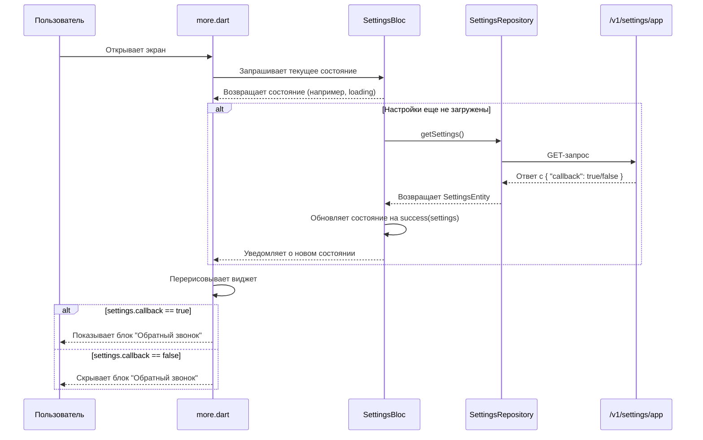

# Дизайн модификации: Скрытие блока "Обратный звонок"

## 1. Обзор

Этот документ описывает дизайн для реализации функционала скрытия блока "Обратный звонок" в зависимости от настроек, получаемых с бэкенда.

## 2. Детальный анализ проблемы

Пользователи должны иметь возможность включать или отключать отображение кнопки "Обратный звонок" в приложении через административную панель. Приложение должно запрашивать эти настройки с сервера и, если получен флаг `callback` со значением `false`, скрывать соответствующий блок в пользовательском интерфейсе.

- **API эндпоинт**: `GET https://admin.monobox.app/api/v1/settings/app`
- **Параметр**: `callback` (boolean)
- **Целевой виджет**: Блок "Обратный звонок", расположенный в `lib/features/order/presentation/widgets/more.dart`.

В приложении уже существует архитектура для получения и обработки настроек (`SettingsBloc`, `SettingsRepository`, `SettingsApiService`), что значительно упрощает задачу.

## 3. Альтернативы

Альтернативных подходов не рассматривалось, так как существующая архитектура приложения уже предоставляет четкий и эффективный способ для реализации данного функционала. Использование `SettingsBloc` является наиболее правильным и последовательным решением.

## 4. Детальный дизайн

### 4.1. Обновление моделей данных

Нужно добавить новое поле `callback` в `SettingsDto` и `SettingsEntity`.

**`lib/features/home/data/models/settings_dto.dart`**

```dart
@JsonSerializable()
class SettingsDto {
  // ... существующие поля
  final bool? callback;

  SettingsDto({
    // ... существующие параметры
    this.callback,
  });

  factory SettingsDto.fromJson(Map<String, dynamic> json) => _$SettingsDtoFromJson(json);
  Map<String, dynamic> toJson() => _$SettingsDtoToJson(this);
}
```

**`lib/features/home/domain/entities/settings_entity.dart`**

```dart
@freezed
class SettingsEntity with _$SettingsEntity {
  const factory SettingsEntity({
    // ... существующие поля
    required bool callback,
  }) = _SettingsEntity;
}
```
Поле `callback` в `SettingsEntity` будет обязательным (`required`), чтобы избежать неопределенного состояния в UI.

### 4.2. Обновление маппера

Маппер `SettingsMapper` должен быть обновлен для корректного преобразования `SettingsDto` в `SettingsEntity`.

**`lib/features/home/data/repository/mappers/settings_mapper.dart`**

```dart
class SettingsMapper {
  static SettingsEntity toEntity(SettingsDto model) {
    return SettingsEntity(
      // ... существующие поля
      callback: model.callback ?? false, // По умолчанию false, если с бэкенда придет null
    );
  }
}
```

### 4.3. Обновление пользовательского интерфейса

В виджете `more.dart` необходимо использовать `BlocBuilder` для получения состояния `SettingsBloc` и условного отображения блока "Обратный звонок".

**`lib/features/order/presentation/widgets/more.dart`**

```dart
// ... импорты
import 'package:monobox/features/home/presentation/bloc/settings/settings_bloc.dart';

// ...

@override
Widget build(BuildContext context) {
  // ...
  return BlocBuilder<SettingsBloc, SettingsState>(
    builder: (context, state) {
      return state.maybeWhen(
        success: (settings) {
          if (settings.callback) {
            // Возвращаем виджет "Обратный звонок"
            return _buildCallbackWidget(); // Пример
          } else {
            // Возвращаем пустой контейнер, если callback отключен
            return const SizedBox.shrink();
          }
        },
        // По умолчанию показываем виджет, если настройки еще не загружены
        orElse: () => _buildCallbackWidget(), // Пример
      );
    },
  );
}

Widget _buildCallbackWidget() {
  // ... существующий код виджета "Обратный звонок"
}
```

### 4.4. Диаграмма последовательности



## 5. Краткое резюме

1.  **Модели**: Добавить поле `callback` в `SettingsDto` и `SettingsEntity`.
2.  **Маппер**: Обновить `SettingsMapper` для обработки нового поля.
3.  **UI**: В `more.dart` использовать `BlocBuilder<SettingsBloc, SettingsState>` для условного отображения блока "Обратный звонок".

## 6. Исследования

Для подготовки этого документа не потребовалось внешних исследований, так как вся необходимая информация была найдена в кодовой базе проекта.