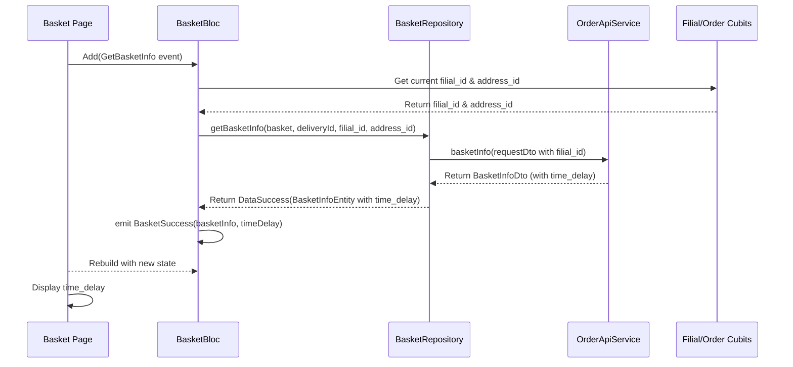

# Дизайн Модификации: Отображение Времени Доставки

## 1. Обзор

Этот документ описывает дизайн для реализации отображения актуального времени доставки (`time_delay`) в корзине. Для этого необходимо модифицировать сетевой запрос к API корзины, добавив в него `filial_id` и, при необходимости, `address_id`, обработать полученное значение и отобразить его в пользовательском интерфейсе.

## 2. Анализ Проблемы

На данный момент приложение не запрашивает и не отображает предполагаемое время доставки при расчете корзины. Пользователь не информирован о том, сколько времени займет доставка его заказа, что является важной информацией для принятия решения о покупке.

**Требования:**
1.  При расчете корзины в API-метод `/api/v1/basket` должен передаваться `filial_id`.
2.  Если выбран способ доставки "доставка", в тот же метод должен передаваться `address_id`.
3.  API возвращает в ответе поле `time_delay`.
4.  Это значение `time_delay` должно быть сохранено в состоянии корзины и отображено в UI.

## 3. Альтернативы

В качестве альтернативы можно было бы показывать статичное, примерное время доставки, но это не соответствует требованиям и не дает пользователю точной информации, зависящей от филиала и адреса. Текущий подход, основанный на получении данных от бэкенда, является единственно верным.

## 4. Детальный Дизайн

Модификация затронет четыре слоя приложения: **Data (данные)**, **Domain (домен)**, **Presentation (представление)** и **State Management (управление состоянием)**.

### 4.1. Слой Данных (Data Layer)

#### 4.1.1. Модель Запроса (`BasketInfoRequestBasketDto`)

В класс `BasketInfoRequestBasketDto` будет добавлено новое поле `filialId`.

**`lib/features/order/data/models/basket_info_request_basket_dto.dart`**
```dart
@JsonSerializable(
  includeIfNull: false,
  fieldRename: FieldRename.snake,
)
class BasketInfoRequestBasketDto {
  BasketInfoRequestBasketDto({
    required this.basket,
    required this.deliveryId,
    this.addressId,
    this.filialId, // Новое поле
  });

  final List<BasketInfoRequestDto> basket;
  final int deliveryId;
  final int? addressId;
  final int? filialId; // Новое поле

  // ... остальной код без изменений
}
```

#### 4.1.2. Модель Ответа (`BasketInfoDto`)

В класс `BasketInfoDto` будет добавлено новое поле `timeDelay`.

**`lib/features/order/data/models/basket_info_dto.dart`**
```dart
@JsonSerializable(
  fieldRename: FieldRename.snake,
  createToJson: false,
)
class BasketInfoDto {
  BasketInfoDto({
    this.products = const [],
    required this.totalInfo,
    this.pretotalInfo = const [],
    required this.bonusInfo,
    this.warnings = const [],
    this.timeDelay, // Новое поле
  });

  final List<ProductDto> products;
  final BasketTotalInfoDto totalInfo;
  final List<BasketPretotalnfoDto> pretotalInfo;
  final BasketPretotalnfoDto bonusInfo;
  final List<String> warnings;
  final String? timeDelay; // Новое поле

  // ... остальной код без изменений
}
```
После изменения DTO необходимо будет запустить `build_runner` для генерации нового кода сериализации.

#### 4.1.3. Репозиторий (`BasketRepositoryImpl`)

Метод `getBasketInfo` в `BasketRepositoryImpl` будет модифицирован для получения и передачи `filial_id`.

- **Получение `filial_id`**: `filial_id` будет извлекаться из `FilialCubit`, который хранит состояние текущего выбранного филиала.
- **Передача `filial_id`**: `filial_id` будет добавлен в `BasketInfoRequestBasketDto`.
- **Обработка `time_delay`**: Полученное из `BasketInfoDto` поле `timeDelay` будет передано в `BasketInfoEntity`.

### 4.2. Слой Домена (Domain Layer)

#### 4.2.1. Сущность Корзины (`BasketInfoEntity`)

В `BasketInfoEntity` будет добавлено поле `timeDelay` для передачи данных на уровень представления.

**`lib/features/basket/domain/entities/basket_info_entity.dart`**
```dart
class BasketInfoEntity extends Equatable {
  final List<ProductEntity> products;
  final BasketTotalInfoEntity totalInfo;
  final List<BasketPretotalnfoEntity> pretotalInfo;
  final BasketPretotalnfoEntity bonusInfo;
  final List<String> warnings;
  final String? timeDelay; // Новое поле

  const BasketInfoEntity({
    required this.products,
    required this.totalInfo,
    required this.pretotalInfo,
    required this.bonusInfo,
    required this.warnings,
    this.timeDelay, // Новое поле
  });

  @override
  List<Object?> get props => [
        products,
        totalInfo,
        pretotalInfo,
        bonusInfo,
        warnings,
        timeDelay, // Новое поле
      ];
}
```

### 4.3. Управление Состоянием (State Management)

#### 4.3.1. Состояние Корзины (`BasketState`)

В состояние `BasketSuccess` класса `BasketState` будет добавлено поле `timeDelay`.

**`lib/features/basket/presentation/bloc/basket/basket_state.dart`**
```dart
abstract class BasketState extends Equatable {
  // ...
}

class BasketSuccess extends BasketState {
  final BasketInfoEntity basketInfo;
  final String? timeDelay; // Новое поле

  const BasketSuccess({required this.basketInfo, this.timeDelay});

  @override
  List<Object?> get props => [basketInfo, timeDelay];
}
```

#### 4.3.2. Логика Корзины (`BasketBloc`)

`BasketBloc` будет обновлен для управления `timeDelay`.
- При успешном выполнении запроса `getBasketInfo` в событии `GetBasketInfo` значение `timeDelay` из `BasketInfoEntity` будет извлечено и сохранено в `BasketSuccess` state.

### 4.4. Слой Представления (Presentation Layer)

#### 4.4.1. UI Корзины

В виджете, отвечающем за отображение итоговой информации в корзине (вероятно, `ItogoBottom` в `lib/features/basket/presentation/widgets/itogo_bottom.dart`), будет добавлено новое текстовое поле.

- Оно будет слушать `BasketBloc`.
- Когда `state` является `BasketSuccess` и `state.timeDelay` не пусто, оно будет отображать виджет `Row` с иконкой часов и текстом `state.timeDelay`.
- Если `timeDelay` отсутствует, виджет будет скрыт.

### 4.5. Диаграмма Последовательности



## 5. Краткое Содержание Дизайна

1.  **Модели данных**: Добавить `filialId` в `BasketInfoRequestBasketDto` и `timeDelay` в `BasketInfoDto`.
2.  **Домен**: Добавить `timeDelay` в `BasketInfoEntity`.
3.  **Репозиторий**: Обновить `BasketRepositoryImpl` для получения `filial_id` из `FilialCubit` и передачи его в DTO запроса.
4.  **BLoC**: Обновить `BasketBloc` и `BasketState` для хранения и предоставления `timeDelay` в UI.
5.  **UI**: Добавить виджет в `ItogoBottom` для отображения времени доставки, если оно доступно.
6.  **Кодогенерация**: Запустить `build_runner` после изменения моделей.

## 6. Исследования

На данном этапе внешние исследования не требуются, так как модификация полностью укладывается в существующую архитектуру проекта.