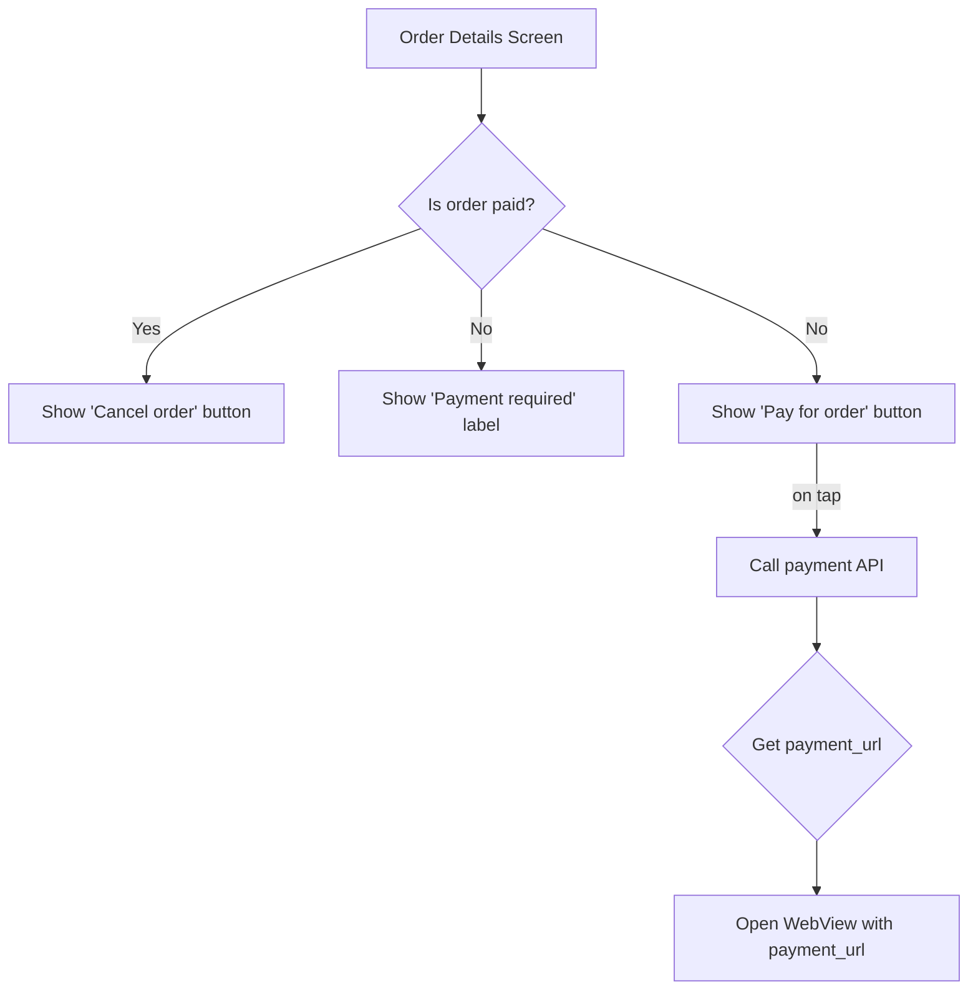

# Design Document: Payment Button for Unpaid Orders

## 1. Overview

This document outlines the design for a modification to the order details screen. The goal is to add a "Pay for order" button and a "Payment required" notice for orders that have been created but not yet paid. This will improve user experience by making it clear when an order requires payment and providing a direct way to complete it.

## 2. Problem Analysis

Currently, when a user has an unpaid order, the UI does not clearly indicate that a payment is required, nor does it provide a direct way to pay. The user has to manually navigate to a payment section or re-initiate the payment process, which is not ideal.

The proposed solution is to:
1.  In the order details screen, check if the order is unpaid.
2.  If the order is unpaid:
    *   Display a prominent "Payment required" label.
    *   Replace the "Cancel order" button with a "Pay for order" button.
3.  When the "Pay for order" button is tapped, the application will fetch a payment URL from the backend and open it in a web view to allow the user to complete the payment.

This will be implemented in the `order_page.dart` file, using the `paymentStatus` field from the `OrderDetailsDto` to determine if an order is paid.

## 3. Alternatives Considered

No significant alternatives were considered, as the user's request is specific and aligns with standard e-commerce application practices. The proposed solution is a direct implementation of the user's requirements.

## 4. Detailed Design

The implementation will be focused on the `lib/features/order/presentation/pages/order_page.dart` file.

### 4.1. Data Model

The `OrderDetailsDto` from `lib/features/order/data/models/order_details_dto.dart` will be used. The `paymentStatus` boolean field will be the primary indicator of the order's payment state.
*   `paymentStatus: true` means the order is paid.
*   `paymentStatus: false` means the order is unpaid.

### 4.2. UI Changes in `order_page.dart`

The widget tree in `order_page.dart` will be modified to conditionally render the "Payment required" label and the "Pay for order" button.

A new stateful widget or a modification to the existing widget will be made to handle the button's state.

```dart
// Pseudocode for the widget build method in order_page.dart

@override
Widget build(BuildContext context) {
  // ... existing code ...

  final bool isPaid = orderDetails.paymentStatus;

  // ... existing code ...

  // Add the "Payment required" label
  if (!isPaid) {
    // Add a Text widget with "Требуется оплата" in red color
  }

  // ... existing code ...

  // Modify the button section
  if (isPaid) {
    // Show the "Cancel order" button
  } else {
    // Show the "Pay for order" button
  }

  // ... existing code ...
}
```

### 4.3. "Pay for order" Button Logic

A new method will be added to the BLoC or Cubit responsible for the `order_page.dart` to handle the payment logic.

1.  When the "Pay for order" button is tapped, a new event will be added to the BLoC/Cubit.
2.  The BLoC/Cubit will call a new method in the order repository (and subsequently the data source) to make a GET request to `https://admin.monobox.app/api/v1/order/pay/{ID}`.
3.  The repository will parse the response and extract the `payment_url`.
4.  The BLoC/Cubit will emit a new state containing the `payment_url`.
5.  The `order_page.dart` will listen for this new state and, upon receiving it, will navigate to the `CustonWebViewPage`, passing the `payment_url`.

### 4.4. Diagram



## 5. Summary

The modification will be implemented by conditionally rendering UI elements in `order_page.dart` based on the `paymentStatus` field of the `OrderDetailsDto`. A new BLoC/Cubit event and state will be added to handle the payment process, which involves fetching a payment URL from the backend and opening it in the existing `CustonWebViewPage`.

## 6. References

No external web research was required. The design is based on the analysis of the existing codebase.
