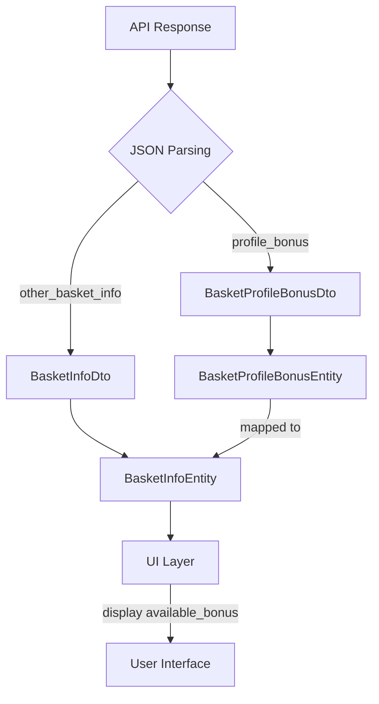

# Дизайн-документ модификации: Интеграция бонусов профиля в корзину

## Обзор

Целью данной модификации является интеграция информации о бонусах профиля пользователя, получаемой из API корзины, в приложение. В частности, будет добавлена возможность отображения и использования `available_bonus` (доступных бонусов) при оформлении заказа.

## Детальный анализ цели/проблемы

Изначально API корзины возвращает объект `profile_bonus`, содержащий `total_bonus` и `available_bonus`. Однако текущая реализация приложения не парсит и не использует эти данные. `ProfileBonusDto` существует, но его структура не соответствует `profile_bonus` из ответа корзины, и он используется в другом контексте (профиль пользователя).

Проблема заключается в том, что пользователь может иметь большое количество бонусов, но только часть из них может быть использована в текущем заказе. Эта информация (`available_bonus`) критически важна для корректного отображения и применения бонусов в UI корзины.

## Рассмотренные альтернативы

1.  **Переиспользование существующего `ProfileBonusDto`:** Эта альтернатива была отклонена, так как структура `ProfileBonusDto` (`count`, `available`) не соответствует структуре `profile_bonus` из ответа корзины (`total_bonus`, `available_bonus`). Попытка переиспользования привела бы к ошибкам парсинга и некорректной работе.

2.  **Игнорирование `profile_bonus` из API корзины:** Эта альтернатива была отклонена, так как она не решает основную проблему пользователя и не позволяет использовать функциональность `available_bonus`.

## Детальный дизайн модификации

Модификация будет реализована в несколько этапов, затрагивающих слои данных и домена, а затем и слой представления (UI).

### 1. Слой данных (Data Layer)

*   **Создание `BasketProfileBonusDto`:** Будет создан новый DTO-объект `BasketProfileBonusDto` в `lib/features/order/data/models/basket_profile_bonus_dto.dart`. Этот DTO будет точно соответствовать структуре `profile_bonus` из JSON-ответа API корзины, включая поля `totalBonus` (int) и `availableBonus` (int?).
*   **Обновление `BasketInfoDto`:** В `lib/features/order/data/models/basket_info_dto.dart` будет добавлено новое поле `profileBonus` типа `BasketProfileBonusDto?`. Это позволит парсить `profile_bonus` из JSON-ответа в основной DTO корзины.
*   **Генерация кода:** После создания и обновления DTO-объектов будут запущены команды `flutter pub run build_runner build --delete-conflicting-outputs` для генерации соответствующих `.g.dart` файлов, обеспечивающих корректную JSON-сериализацию/десериализацию.

### 2. Слой домена (Domain Layer)

*   **Создание `BasketProfileBonusEntity`:** Будет создан новый Entity-объект `BasketProfileBonusEntity` в `lib/features/basket/domain/entities/basket_profile_bonus_entity.dart`. Этот Entity будет соответствовать `BasketProfileBonusDto`, содержащему поля `totalBonus` (int) и `availableBonus` (int?).
*   **Обновление `BasketInfoEntity`:** В `lib/features/basket/domain/entities/basket_info_entity.dart` будет добавлено новое поле `profileBonus` типа `BasketProfileBonusEntity?`.
*   **Генерация кода:** После создания и обновления Entity-объектов будут запущены команды `flutter pub run build_runner build --delete-conflicting-outputs` для генерации соответствующих `.freezed.dart` файлов.
*   **Обновление маппера:** В `lib/features/basket/data/repository/basket_repository_impl.dart` будет обновлен метод `getBasketInfo`. В этом методе будет добавлена логика маппинга `basketInfo.profileBonus` (из DTO) в `BasketInfoEntity.profileBonus` (в Entity).

### 3. Слой представления (UI Layer)

*   **Использование `available_bonus` в UI:** После того как данные о `profileBonus` станут доступны в `BasketInfoEntity`, будет реализована логика в UI корзины для отображения `availableBonus` и управления списанием бонусов. Это может включать:
    *   Отображение максимального количества бонусов, которые можно списать.
    *   Поле ввода для указания количества бонусов для списания, с валидацией на основе `availableBonus`.
    *   Обновление общей суммы заказа при применении бонусов.

## Диаграммы

## Резюме дизайна

Данный дизайн предлагает четкий и структурированный подход к интеграции информации о бонусах профиля из API корзины. Создание отдельных DTO и Entity для `profile_bonus` обеспечивает чистоту архитектуры и предотвращает конфликты с существующими моделями. Обновление мапперов гарантирует корректную передачу данных между слоями. Наконец, использование этих данных в UI позволит реализовать функциональность списания бонусов, улучшая пользовательский опыт.

## Ссылки на исследования

*   [Freezed package documentation](https://pub.dev/packages/freezed)
*   [JsonSerializable package documentation](https://pub.dev/packages/json_annotation)
*   [Flutter BLoC pattern](https://bloclibrary.dev/)