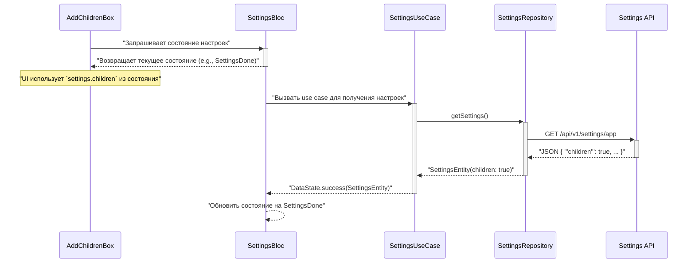

# Модификация: Скрытие блока "Дети"

## 1. Обзор

Цель этой модификации — реализовать логику скрытия UI-блока, предлагающего добавить данные о ребенке. Видимость блока должна управляться параметром, получаемым с бэкенда, а также действиями пользователя в интерфейсе.

## 2. Анализ проблемы

### 2.1. Источник данных
- **Эндпоинт:** `GET https://admin.monobox.app/api/v1/settings/app`
- **Параметр:** `children` (boolean).
- **Проблема:** Текущая модель данных `SettingsDto` в файле `lib/features/home/data/models/settings_dto.dart` не содержит поля `children` и другие (`callback`, `use_promocode`, `use_loyalty`), которые присутствуют в реальном ответе API.

### 2.2. UI Компонент
- **Виджет:** `AddChildrenBox`
- **Файл:** `lib/features/profile/presentation/widgets/add_children.dart`
- **Текущая логика:** Видимость управляется локальным состоянием, которое хранится в классе `Store` и доступно через `getIt`. Метод `isClosedAboutChildren()` определяет, закрыл ли пользователь этот блок ранее.

### 2.3. Архитектура и поток данных
Приложение использует чистую архитектуру (Clean Architecture) со следующими слоями:
1.  **Data Layer:** `SettingsApiService` (Retrofit) -> `SettingsRepositoryImpl`.
2.  **Domain Layer:** `SettingsRepository` (абстракция) -> `SettingsUsecase`.
3.  **Presentation Layer:** `SettingsBloc` -> UI Widgets.

Новая логика должна быть интегрирована в эту архитектуру.

### 2.4. Требования к новой логике
Блок `AddChildrenBox` должен быть видим **ТОЛЬКО ТОГДА**, когда оба условия истинны:
1.  `settings.children == true` (настройка с сервера).
2.  `store.isClosedAboutChildren() == false` (пользователь еще не закрывал блок).

## 3. Рассмотренные альтернативы

1.  **Игнорировать локальное состояние `Store`:** Реализовать логику, основанную только на серверном флаге `children`.
    -   **Недостаток:** Это ухудшит пользовательский опыт. Если пользователь закроет блок, он появится снова при следующей загрузке, что будет раздражать. **Решение отклонено.**
2.  **Динамический парсинг JSON:** Не обновлять `SettingsDto`, а парсить поле `children` напрямую из `Map<String, dynamic>`.
    -   **Недостаток:** Это нарушает существующий паттерн работы с данными (строгая типизация, `json_serializable`), делает код менее читаемым и более хрупким к изменениям. **Решение отклонено.**

## 4. Детальный дизайн модификации

### 4.1. Data Layer: Обновление модели

1.  **Файл:** `lib/features/home/data/models/settings_dto.dart`
2.  **Действие:** Модифицировать класс `SettingsDto`, добавив все недостающие поля из ответа API. Поля будут сделаны nullable (`bool?`), чтобы избежать ошибок при парсинге, если API в будущем перестанет их присылать.

    ```dart
    // Before
    class SettingsDto {
      // ... existing fields
      final bool loyalty;
    }

    // After
    class SettingsDto {
      // ... existing fields
      final bool loyalty;
      final bool? children;
      final bool? callback;
      final bool? usePromocode;
      final bool? useLoyalty;

      // Constructor needs to be updated as well
    }
    ```
3.  **Действие:** После изменения файла `settings_dto.dart` необходимо запустить команду `dart run build_runner build --delete-conflicting-outputs` для регенерации файла `settings_dto.g.dart`.

*Примечание: В рамках этой задачи мы также должны обновить и доменный слой, а именно `SettingsEntity`, чтобы он также содержал поле `children`.*

### 4.2. Domain Layer: Обновление Entity

1.  **Задача:** Найти файл, где определена `SettingsEntity` (вероятно, `lib/features/home/domain/entities/settings_entity.dart`) и добавить в него поле `children`. Репозиторий `SettingsRepositoryImpl` должен будет маппить `SettingsDto.children` в `SettingsEntity.children`.

### 4.3. Presentation Layer: Интеграция в UI

1.  **`SettingsBloc`:** Убедиться, что `SettingsState` (состояние блока) содержит `SettingsEntity` и предоставляет его UI. Текущая реализация `SettingsBloc` уже должна это делать.
2.  **`AddChildrenBox` Widget:**
    -   **Файл:** `lib/features/profile/presentation/widgets/add_children.dart`
    -   **Действие:** Виджет должен получить доступ к состоянию `SettingsBloc`. Вероятнее всего, родительский виджет, который использует `AddChildrenBox`, должен быть обернут в `BlocProvider` или `BlocBuilder` для `SettingsBloc`.
    -   **Действие:** Изменить логику в методе `build`.

    ```dart
    // Pseudocode
    @override
    Widget build(BuildContext context) {
      // 1. Получаем состояние настроек из SettingsBloc
      final settingsState = context.watch<SettingsBloc>().state; // или context.select(...)

      // 2. Получаем локальное состояние
      final store = getIt<Store>();

      // 3. Проверяем, нужно ли показывать блок
      bool showBlock = false;
      if (settingsState is SettingsDone) { // Пример названия состояния
          final settings = settingsState.settings;
          if (settings.children == true && !store.isClosedAboutChildren()) {
              showBlock = true;
          }
      }

      if (!showBlock) {
        return Container(); // Скрываем блок
      }

      // ... остальная часть билдера виджета
    }
    ```

## 5. Диаграмма последовательности



## 6. Итог

План состоит из трех шагов:
1.  **Обновить слой данных:** Синхронизировать `SettingsDto` и `SettingsEntity` с реальным ответом API.
2.  **Пробросить данные:** Убедиться, что `SettingsBloc` корректно получает и хранит обновленную `SettingsEntity`.
3.  **Обновить UI:** Изменить логику видимости в `AddChildrenBox`, используя данные из `SettingsBloc` в комбинации с локальным `Store`.

## 7. Источники
На данном этапе внешние источники не использовались. Дизайн основан на анализе существующего кода.
